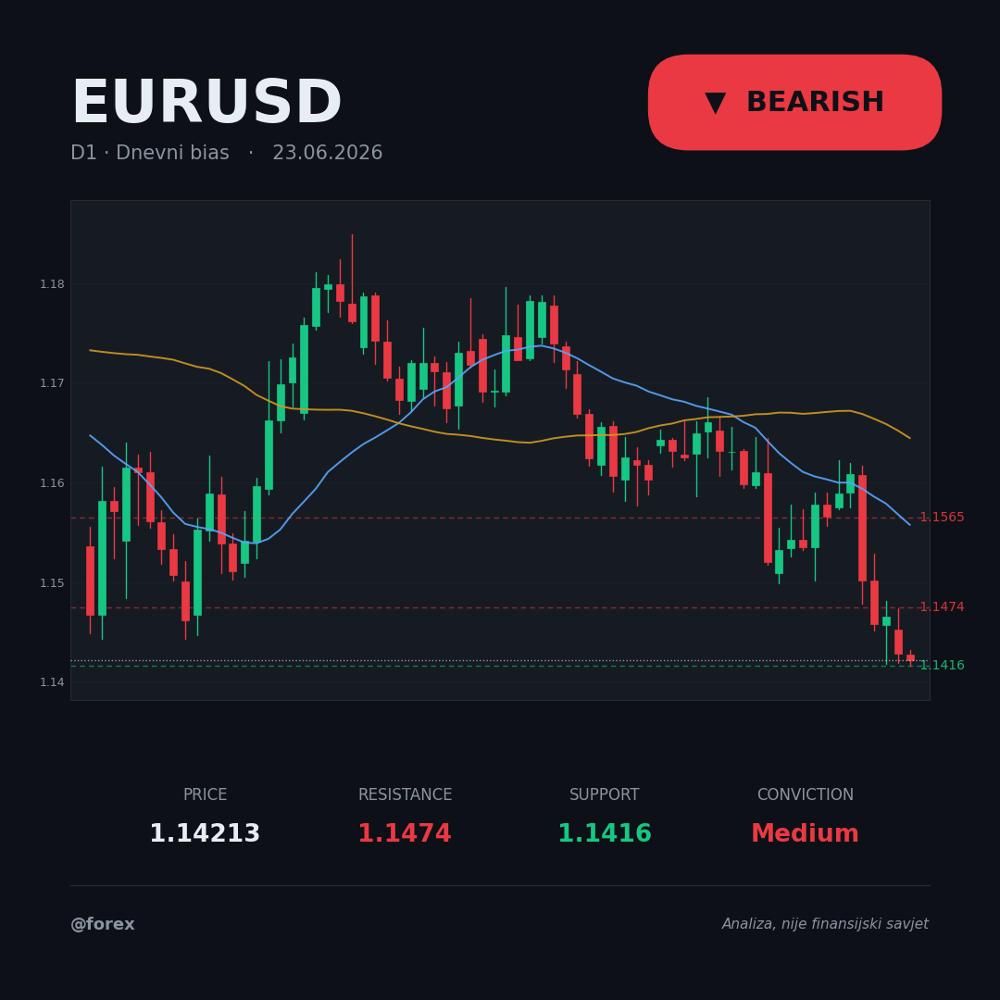

# Forex Forecasting — Claude skill

Ask a plain question about a currency pair or gold and get back a **clear directional bias** plus an **attractive, share-ready chart card** — built from your live MetaTrader 5 data.

> Example: *"Daj mi dnevni bias za EURUSD"* / *"Is gold bullish? Key levels?"* →



The directional **bias** is the headline output (bullish / bearish / neutral) with a conviction level, the key support/resistance levels, the fundamental context, and an invalidation. A full trade setup (entry / stop / target / position size) is added **only when you ask for one**.

This skill **analyzes and proposes only** — it never places, modifies, or closes any order. You always execute trades yourself.

---

## What you get

- **Bias card** (`scripts/card.py`) — a polished dark-theme square graphic (1080×1080, also `portrait` and `wide`) with the candlestick chart, a bold bias badge, key levels, conviction, and price. Made to copy and post on Instagram / X.
- **Written bias report** — bias + conviction, the technical case across timeframes, key levels, fundamental context, and the invalidation.
- **Optional detailed chart** (`scripts/chart.py`) — multi-timeframe panels (D1/H4/H1) with an optional setup overlay (entry/stop/target zones).
- **Analytics helper** (`scripts/ta.py`) — SMA/EMA, RSI, MACD, ATR, swing levels, and position sizing.

---

## How it reaches the analysis (checklist)

1. **Data** — pulls the full candle series from MT5 on three timeframes: D1 (trend), H4 (structure), H1 (timing); plus current price/spread and (if sizing) account balance.
2. **Trend** — price vs SMA50/SMA200, higher-highs/lower-lows, and whether the timeframes agree.
3. **Momentum** — RSI (overbought/oversold, divergence) and MACD.
4. **Key levels** — swing highs/lows → nearest support below and resistance above.
5. **Volatility** — ATR, for realistic stops/targets instead of round numbers.
6. **Fundamentals** — upcoming high-impact events (central banks, CPI/NFP/GDP/PCE) and the macro backdrop; for gold, real yields / the dollar / risk sentiment.
7. **Conclusion** — combine into a bias + conviction, name the invalidation, and render the card.
8. **Sanity check** — support below / resistance above price, stop on the correct side, R:R computes, data is fresh.

---

## Requirements

- **Claude** with the **MetaTrader 5 MCP connector** connected (this is the data source — the skill will not work without it).
- **Python 3** with **matplotlib** for the chart/card scripts:

  ```bash
  pip install -r requirements.txt
  ```

---

## Installation

**Option A — install the packaged skill (easiest).**
Download `forex-forecasting.skill` from this repo and install it in Claude (Cowork / Claude Code → Settings → Capabilities → install skill, or open the `.skill` file).

**Option B — manual.**
Copy the `forex-forecasting/` skill folder (`SKILL.md` + `scripts/`) into your Claude skills directory.

---

## Usage

Just ask, in any language:

- `Daj mi dnevni bias za EURUSD`
- `Is gold bullish or bearish right now? Key levels?`
- `What's your bias on GBPUSD for the next few days?`
- `Make a bias card for USDJPY for Instagram`
- `Short setup on GBPUSD, 1% risk — entry, stop, target, lots` *(adds a sized setup)*

The skill resolves the instrument (e.g. `gold` → `XAUUSD`), pulls live MT5 candles, runs the analysis, and returns the bias report **and** the chart card.

---

## Disclaimer

This skill produces **analysis only — not financial advice**. It never executes, modifies, or closes trades. Always do your own research and execute any trade yourself. Trading forex carries substantial risk.

---

*All rights reserved. No license granted for reuse at this time.*
